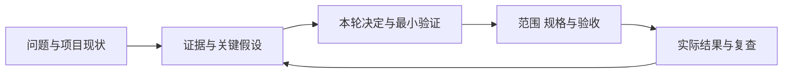

# AI Product Manager OS

**面向 AI、Agent、SaaS 与 0→1 项目的中文产品经理 Skill：把用户问题、证据、决策、交付与复查连接起来。**

[](product-manager/CHANGELOG.md)
[](LICENSE)

它让 Agent 按任务选择方法与模板，帮助你判断需求是否值得做、首版应保留什么、AI 功能怎样验收，以及上线后该继续、调整还是停止。重要建议都应说明依据、关键假设、责任人、下一动作和复查条件。

当前版本：**v1.1.2（2026-10-06）**。源码、模板、工作流和测试材料完整公开；客户资料和项目私有记录不随源码发布。

## 从这里开始

| 你想做什么 | 阅读入口 |
|---|---|
| 了解定位、方法、架构与能力边界 | [专业介绍与产品运营指南](PRODUCT_MANAGER_OS_GUIDE.md) |
| 安装并完成第一次调用 | [Codex／Claude／WorkBuddy 安装与升级](product-manager/INSTALL.md) |
| 查常用指令、24 个模式与详细步骤 | [详细使用说明](product-manager/USER_GUIDE.md) |
| 按一个案例练习从需求到验收 | [电商 AI 客服演练](product-manager/examples/ecommerce-customer-service.md) |
| 查看运行规则或本次修复 | [SKILL.md](product-manager/SKILL.md) · [CHANGELOG](product-manager/CHANGELOG.md) |

## 能解决哪些问题

| 场景 | 提供的帮助 |
|---|---|
| 新想法与需求发现 | 澄清用户、真实问题、替代方案与最小验证 |
| 已有项目接手与改版 | 反推能力、依赖与任务流程，区分实现、部署和用户验收 |
| 范围与交付 | 优先级、MVP、PRD、页面状态、异常路径和研发验收 |
| 研究与商业决策 | 用户研究、竞品情报、定价、指标和 Roadmap |
| AI 产品 | 按任务组合 Workflow、RAG、Tools、Agent 或微调；定义 Eval、人工兜底、延迟与成功任务成本 |
| 上线与持续改进 | 灰度、监测、回退、复盘和保留历史的决策闭环 |

核心机制包括按需加载、项目上下文、证据门槛、反向评审和决策记录。你不需要先记住模式名，也不需要每次填满全部模板。

## 快速上手

克隆源码，在仓库根目录检查完整性：

```bash
git clone https://github.com/pylon12345/product-manager-os.git
cd product-manager-os
python product-manager/validate.py
```

按[安装说明](product-manager/INSTALL.md)安装完整的 `product-manager/` 目录。Python 3.10+ 仅用于包校验和评分器测试；纯指令调用不要求 Python 或本仓库的 API Key。

首次调用示例（Codex）：

```text
$product-manager
我正在做面向电商商家的 AI 客服产品，覆盖售前与售后。
当前只有想法，没有访谈、真实咨询数据或已接入业务系统。
先判断最值得验证的问题与首版边界，区分事实、假设和待验证项。
给最小验证、成功标准、停止条件和下一动作，不要编造数据。
```

Claude Code 使用 `/product-manager`；Claude 网页／桌面端和 WorkBuddy 按安装说明导入并启用 ZIP，再自然语言指定本技能。需要生成文件时，明确目标目录与授权范围。完整操作见[使用说明](product-manager/USER_GUIDE.md)。

## 工作方式



项目记录可使用 `.pmcontext.md`、`product/evidence.md` 和 `product/decisions.md`。Skill 在获授权的范围内读取或维护记录；安装本身不启动后台任务，不自动联系用户、发布产品或操作生产系统。

## v1.1.2 更新

- 新增正向（从想法到复盘）与反向（从已有产品或竞品到决定）的标准流程，并合并两个重叠的旧正向流程。
- 移除可选网页知识库工具：同步结果大多是目录页和落地页，且易变事实本就需实时核对。
- 功能开发先定指标、评审通过再交接；AI 0→1 先收集样本再选架构。
- 统一证据标签、能力状态与决策状态词表；SKILL.md 增加工作流索引。

## v1.1.1 更新

- 拒收已知的 HTTP 200 访问拦截、验证和密码登录页面，保留最新有效知识快照。
- AI 架构按任务缺口选择与组合能力，取消必须逐级升级的固定路线。
- 补齐基础判断、框架和 AI 产品知识的按需入口，统一术语维护入口。
- 明确与 `product-manager-skills` 的分工，保留自动发现与显式选择。
- 更新专业介绍、安装升级、详细使用说明和电商 AI 客服演练。

## 质量检查

从仓库根目录运行：

```bash
python product-manager/validate.py
python -m unittest discover -s product-manager/tests/behavior -p "test_*.py"
python product-manager/tests/behavior/score.py --check
```

包校验检查结构，离线测试检查工具与评分器，8 个冻结案例检查材料完整性。**这些命令不调用模型，不证明真实业务效果，也不等于 8 个案例已通过模型盲测。** 实际行为测试须保存原始回答，再按[评估协议](product-manager/tests/behavior/README.md)评分。

本 Skill 定义产品任务、流程、信息结构和验收；高保真界面、代码实现与实际部署由设计和开发工作流完成。它辅助产品判断，不能替代真实用户研究、负责人决策或系统验收。

## 开源与文档

源码、模板与本仓库文档采用 [Apache-2.0](LICENSE)。方法来源见 [SOURCES](product-manager/SOURCES.md)；第三方网页内容仍受原权利约束，不包含在发行包中。

[配套说明仓库](https://github.com/pylon12345/product-manager-os-docs)提供独立阅读入口，文档许可见该仓库；源码与版本以本仓库为准。
